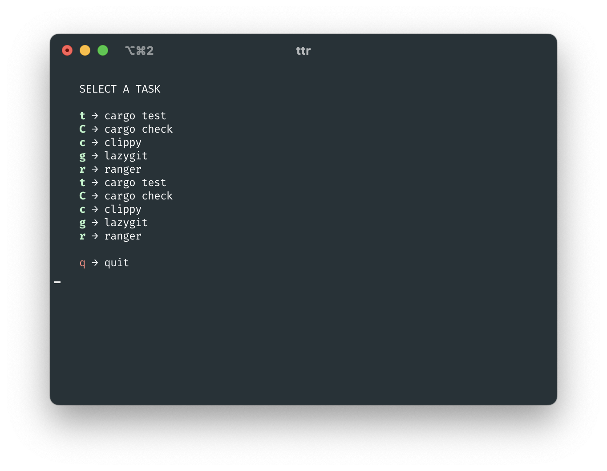

## Terminal Task Runner

The idea behind `ttr` is the same as behind Vim [WhichKey](https://github.com/folke/which-key.nvim). It allows you to run tasks using simple one character codes.

The main difference is ttr doesn't depend on any editor and works right in the shell.



## Features

* supports project-local as well as global tasks
* confirmation after exit for non interactive applications
* simple yaml configuration

## Configuration

`ttr` looks for a `.ttr.yaml` in a current working directory as well as home directory. Tasks from both files are merged together.

Configuration example:

```yaml
- name: lazygit
  key: g
  cmd: lazygit

- name: test
  key: t
  cmd: cargo
  args: [test]
  confirm: true # displays confirmation after command exited
```

## Integration with terminals

### Tmux

In tmux you can use shortcut to run `ttr` like this:

```
bind t new-window sh -c "ttr"
```

Now on `<leader>t` ttr will be executed in a new window in the current session. You also can map a key in a normal mode (no need to press the `<leader>` key first)

```
bind -n C-Space new-window sh -c "ttr"
```

this will bind `ttr` to <kbd>Ctrl</kbd>+<kbd>Space</kbd>.

### iTerm2

In iTerm yoy can [assign shortcuts](https://stackoverflow.com/questions/67222677/keyboard-shortcut-to-execute-a-shell-command-in-iterm2) to execute `ttr`.