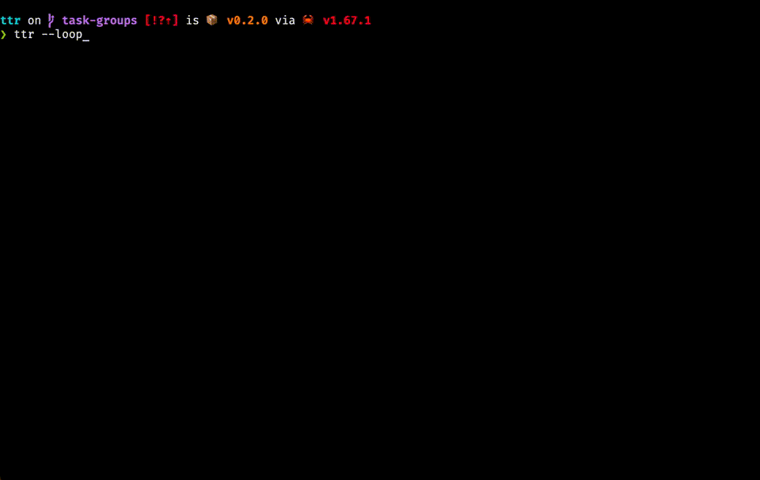

## Terminal Task Runner

The idea behind `ttr` is the same as behind Vim [WhichKey](https://github.com/folke/which-key.nvim). It allows you to run tasks using simple one character codes.

The main difference is ttr doesn't depend on any editor and works right in the shell.



## Features

* supports project-local as well as global tasks
* task groups to keep memorable mnemonics for tasks (`ct` for `cargo test` etc.)
* confirmation after exit for non interactive applications
* loop-mode allows quickly select next task after previous completed
* ability to clear terminal before task run
* simple yaml configuration

## Installation

### Homebrew (macOS and Linux)

```console
$ brew install bazhenov/tap/ttr
```

### Linux (.deb)

```console
$ cur -OL https://github.com/bazhenov/ttr/releases/download/0.3.0/ttr-0.3.0-x86_64-unknown-linux-gnu.deb
$ dpkg -i ttr-0.3.0-x86_64-unknown-linux-gnu.deb
```

### Building from sources

You need rust toolchain to be installed.

```console
$ cargo install --git=https://github.com/bazhenov/ttr.git
```

## Configuration

`ttr` looks for a `.ttr.yaml` file in following directories:

* current working directory and parent directories till the home dir (like a git);
* home directory;
* config directory (`$XDG_CONFIG_HOME` or `.config/ttr` on Linux and `~/Library/Application Support/ttr` on macOS).

Tasks from all files are merged together. Prirority is given to task defined earlier.

Configuration example:

```yaml
groups:
- name: git
  key: g
  tasks:
  - name: lazygit
    key: g
    cmd: lazygit
  - name: git diff
    key: d
    cmd: git diff
- name: cargo
  key: c
  tasks:
  - name: test
    key: t
    cmd: cargo test
    confirm: true # displays confirmation after command exited
    clear: true # clears terminal before running command
  - name: run
    key: r
    cmd: cargo run
```

## Integration with terminals

### zsh

Add following code to your `.zshrc`

```
bindkey -s '^k' '^E^Uttr^M'
```

This will bind `ttr` to <kbd>Ctrl</kbd>+<kbd>k</kbd>

### fish

Put following in `~/.config/fish/config.fish`

```
bind \ck 'echo; ttr; commandline -f repaint'
```

### bash

Analog in bash would be following configuration in  `.bashrc`

```
bind -x '"\C-K":"ttr"'
```

### Tmux

In tmux you can use shortcut to run `ttr` like this:

```
bind t new-window sh -c "ttr"
```

Now on `<leader>t` ttr will be executed in a new window in the current session. You also can map a key in a normal mode (no need to press the `<leader>` key first)

```
bind -n C-Space new-window sh -c "ttr"
```

this will bind `ttr` to <kbd>Ctrl</kbd>+<kbd>Space</kbd>.

### iTerm2

In iTerm you can [assign shortcuts](https://stackoverflow.com/questions/67222677/keyboard-shortcut-to-execute-a-shell-command-in-iterm2) to execute `ttr`.
